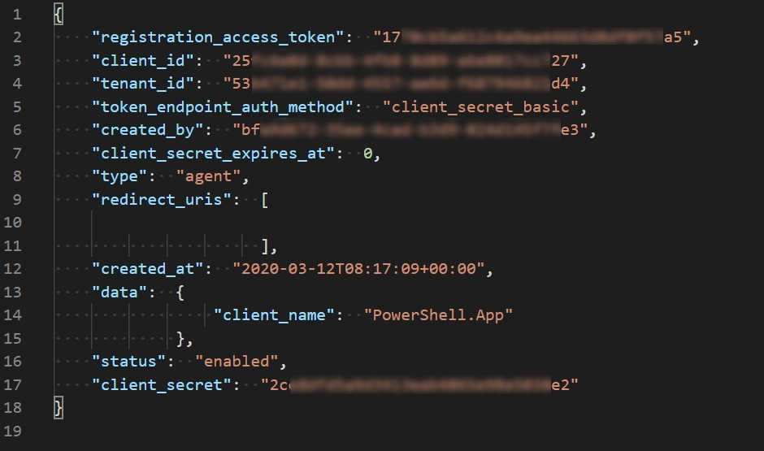
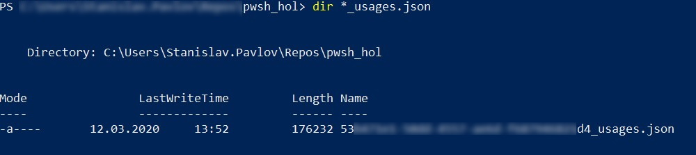
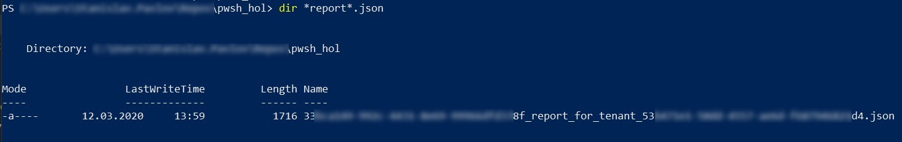

# Base Acronis Cyber Platform API operations with PowerShell

!!! info Copyright © 2019-2021 Acronis International GmbH. This is distributed under MIT license.

!!! note The GitHub repository contains not only code for this Hands-on Lab but other advanced code examples. Please, check [Code Directory](#code-directory) for details.

[[TOC]]

## Code Directory

|Folder name|File name       |File description
|-----------------------------------|--------------------------|--------------------------
|`agent`|`agent_installation.ps1`  |A sample to installing the Agent installation with no user prompts with default settings using an Agent installation token to register at the Acronis Cyber Cloud.
|`agent`|`get_agent_installation_token.ps1`|Create an Agent installation token for a user tenant.
|`agent`|`get_all_agents_for_customer.ps1` |Get list of all Acronis Agents for tenants subtree where the root tenant is a previously created customer.
|`agent`|`get_all_agents_info.ps1` |Get list of all Acronis Agents for tenants subtree where the root tenant is a tenant for which an API Client is created.
|`authorization`|`create_client_to_access_api.ps1` |Creates an API Client (`client_id`, `client_secret`) to generate a JWT token and access the API. The Basic Authentication is used. For Acronis Cyber Protect (Acronis Cyber Cloud 9.0) the Management Console can be used to create an API Client. The result of the script is stored in clear text `api_client.json` file. It's raw answer from the API call. For your solutions, please, implement secured storage for `client_id`, `client_secret` as they are credentials to access the API. The scrip asks for login and password to create an API Client.
|`authorization`|`issue_token_for_bc_customer_scoped.ps1` |Exchange a JWT token to a customer-scoped token to access protection API functionality. The token is expired as soon as the base token expired. Required to have `customer.json` to exchange a token. Not renewed automatically. Requires to be issued for all operations with plans and resources as they expected to be executed in a customer context.
|`authorization`|`issue_token.ps1` |Issue a JWT token to access the API. The token is expired in 2 hours. During the sanity checks in `/common/basis-api-check.ps1` an expiration time for the current token is checked and a token is reissued if needed. The result of the script is stored in clear text `api_token.json` file. It's raw answer from the API call. For your solutions, please, implement secured storage for a JWT token info as they are credentials to access the API.
|`common`|`basis-configuration.ps1`    |Initialize global variables `$baseUrl`,`$partnerTenant`, `$customerTenant` and `$edition` from config files `cyber.platform.cfg.json`and `cyber.platform.cfg.defaults.json`.
|`common`|`basis-api-check.ps1`    |Base sanity checks need to be performed before the API calls.
|`common`|`basis-functions.ps1`    |Contains some utilities functions to simplify the API usage.
|`common`|`init.ps11`              |Includes `basis-configuration.ps1`, `basis-api-check.ps1` and `basis-functions.ps1` to simplify incudes to all other files.
|`images`| |The images for this guide.
|`monitoring`|`get_all_activities_for_`<br/>`the_last_week_for_backup_with_error.ps1` |An example of basic activities filtering: the last 7 days activities for backup ended with errors.
|`monitoring`|`get_all_activities_for_the_last_week.ps1`|Get all activities completed the last 7 days.
|`monitoring`|`get_all_activities_with_pagination.ps1`|An example of activities pagination.
|`monitoring`|`get_all_alerts_for_the_last_week.ps1`|Get all alerts updated the last 7 days.
|`monitoring`|`get_all_alerts_with_pagination.ps1`|An example of alerts pagination.
|`monitoring`|`get_all_task_for_the_last_week.ps1`|Get all task completed the last 7 days.
|`monitoring`|`get_all_task_with_pagination.ps1`|An example of tasks pagination.
|`pdf`| |This guide rendered to PDF format.
|`plans`|`apply_plan.ps1`|Apply the first applicable plan for the first resource.
|`plans`|`base_plan.json`|A backup plan template.
|`plans`|`create_a_backup_plan.ps1`|Create a backup plan based on `base_plan.json` template.
|`plans`|`get_all_plans_info.ps1`|the the list of all protection plans available in authorization scope.
|`plans`|`revoke_plan.ps1`|Revoke the first applicable plan from the first resource.
|`plans`|`start_plan_execution.ps1`|Start the first plan for the first resource execution.
|`report`|`create_and_download_simple_report.ps1`|Create an one time report to save for the root tenant, wait till its creation and download.
|`report`|`create_and_download_sku_report.ps1`|Create an one time report for direct partners and SKU information included to save for the root tenant, wait till its creation and download.
|`resources`|`create_dynamic_group.ps1`|Create a dynamic group for resources.
|`resources`|`get_all_resources_info.ps1`|Get the list of all resources available in authorization scope.
|`resources`|`get_all_resources_protection_status.ps1`|Get the list of all resources available in authorization scope with their protection statuses.
|`tenants`|`create_partner_tenant.ps1`|Creates a partner with name _Partner: PowerShell Examples v3.0_ and enables all available offering items for them for an edition, specified in json configuration files `cyber.platform.cfg.json` and  `cyber.platform.cfg.defaults.json`.
|`tenants`|`create_customer_tenant.ps1`|Creates a customer with name _Customer: PowerShell Examples v3.0_ and enables all available offering items for them for an edition, specified in json configuration files `cyber.platform.cfg.json` and  `cyber.platform.cfg.defaults.json`.
|`usage`|`get_tenant_usages.ps1`    |Gets usage for the root tenant.
|`users`|`assign-customer-user-admin-role.ps1`|Assign a user of _Customer: PowerShell Examples v3.0_ the `company_admin` role.
|`users`|`assign-customer-user-backup-role.ps1`|Assign a user of _Customer: PowerShell Examples v3.0_ the `backup_user` role.
|`users`|`assign-partner-user-admin-role.ps1`|Assign a user of _Partner: PowerShell Examples v3.0_ the `partner_admin` role.
|`users`|`create_user_for_customer_activate.ps1`|Creates a user for _Customer: PowerShell Examples v3.0_ and activates them by sending an e-mail. The script asks for a username and an e-mail to create.
|`users`|`create_user_for_partner_activate.ps1`|Creates a user for _Partner: PowerShell Examples v3.0_ and activates them by sending an e-mail. The script asks for a username and an e-mail to create.
|`users`|`user_impersonalization.ps1`|Generate a link to impersonate a user.
|`LICENSE`       | |The license for the code. It's MIT license.
|`README.md`       | |This file.
|`cyber.platform.cfg.defaults.json` | |Contains default configuration values for the scripts. They are used when the values are not defined in `cyber.platform.cfg.json` file.
|`cyber.platform.cfg.json`   | |Contains configuration values for the scripts.

## The Acronis Cyber Platform API general workflow

|#|Operation|When/Period|Prerequisites / Inputs
|---|---|---|---
|1| Create an API client under which an integration will be authorized |Initially.<br/><br/>Periodically if security policies require your company to regenerate all passwords each X months.<br/><br/>Through the API or the Management Portal for ACC 9.0 and greater. |Login and password with a needed level of access in Acronis Cyber Cloud.<br/><br/>Usually, it's a service Admin account under your company’s Partner tenant in Acronis Cyber Cloud.
|2|Issue an access token|1. Before the first API Call which is not connected to the authorization flow<br/><br/>2. Each time when your token is near to be expired.|Your API Client credentials
|3|Make API calls||An access token issued using your API Client credentials

## Prerequisites and basis information

To run the scripts, you need to edit or create the `cyber.platform.cfg.json` file to provide base parameters. At minimum you need to change `base_url` to your data center URL. The global variables `$baseUrl` initialized from the config file and used for all API requests. All other values can remain unchanged.
A `cyber.platform.cfg.json` file example:

```json
{
 "base_url": "https://dev-cloud.acronis.com/",
 "partner_tenant": "partner",
 "customer_tenant": "customer",
 "edition": "pck_per_workload"
}
```

## Exercise 1: Create an API Client to access the API

### Implementation details

A JWT token with a limited time to life approach is used to securely manage access of any API clients, like our scripts, for the Acronis Cyber Cloud. Using a login and password for a specific user is not a secure and manageable way to create a token, but technically it's possible. Thus, we create an API client with a client id and a client secret to use as credentials to issue a JWT token.
To create an API Client, we call the `/clients` end-point with POST request specifying in the JSON body of the request a tenant we want to have access to. To authorize this the request, the Basic Authorization with user login and password for Acronis Cyber Cloud is used.

!!! note In Acronis Cyber Cloud 9.0 API Client credentials can be generated in the Management Portal.

!!! note Creating an API Client is a one-time process. As the API client is used to access the API, treat it as credentials and store securely. Also, do not store the login and password in the scripts itself.

In the following code block a login and a password are requested from a command line and use it for a Basic Authorization for following HTTP requests.

```PowerShell
# Get credentials from command line input
$cred = (Get-Credential).GetNetworkCredential()

# Use Login and Password to create an API client
$login = $cred.UserName
$password = $cred.Password
```

In those scripts it is expected that the [Acronis Developer Sandbox](https://developer.acronis.com/sandbox/) is used. It is available for registered developers at [Acronis Developer Network Portal](https://developer.acronis.com/). So the base URL for all requests (https://devcloud.acronis.com/) is used. Please, replace it with correct URL for your production environment if needed. For more details, please, review the [Authenticating to the platform via the Python shell tutorial](https://developer.acronis.com/doc/platform/management/v2/#/http/developer-s-guide/authenticating-to-the-platform-via-the-python-shell) from the Acronis Cyber Platform documentation.

For demo purposes, this script issues an API client for a tenant for a user for whom a login and a password are specified. You should add your logic as to what tenant should be used for the API Client creation.

```PowerShell
# Get Self information to have tenant_id
$myInfo = Invoke-RestMethod  -Uri "${baseUrl}api/2/users/me" -Headers $headers
$tenantId = $myInfo.tenant_id

# Body JSON, to request an API Client for the $tenantId
$json = @"
{
    "type": "api_client",
    "tenant_id": "$tenantId",
    "token_endpoint_auth_method": "client_secret_basic",
    "data": {
        "client_name": "PowerShell.App"
    }
}
"@
```

!!! note `client_name` value defines the name you will see in the ACC 9.0 Management Console. For real integrations, please, name it carefully to have a way to identify it in a future.

```PowerShell
# Create an API Client
$client = Invoke-RestMethod -Method Post -Uri "${baseUrl}api/2/clients" -Headers $headers -Body $json

# Save the API Client info to file for further usage
# YOU MUST STORE YOUR CREDENTIALS IN SECURE PLACE
# A FILE USES FOR CODE SIMPLICITY
$client | ConvertTo-Json -Depth 100 | Out-File "api_client.json"
```

!!! note A generated client is inherited access rights from a user used for the generation but it's disconnected from them. You don't need to issue a new client even if the user account is removed from Acronis Cloud.

!!! warning Treat API Clients as a specific service account with access to your cloud. All internal security policies applied to your normal account operations should be in place for API Clients. Thus, don't create new API Clients if you don't really required and disable/delete unused API Clients through the Management Console or API Calls.

!!! warning You can receive a `client_secret` only once, just at the issue time. If you loose your `client_secret` further you must reset secret for the client through the Management Console or API Calls. Please, be aware, that all the tokens will be invalidated.

!!! danger You need to securely store the received credentials. For simplicity of the demo code, a simple JSON format is used for `api_client.json` file. Please remember to implement secure storage for your client credentials.

### Step-by-step execution and checks

1. Open any available `PowerShell` environment: Linux, Mac or Windows.
2. Copy code directory to your local system and ensure that all `.ps1` files are executable in Linux and Mac cases. We will use Windows PowerShell for this instructions.
3. Edit  `cyber.platform.cfg.json` file to enter your `base_url` aka your data center URL for API calls. All other options remain unchanged.
4. Type `cd au` and press `Tab`, it should autocomplete to the `authorization`.  Type `.\cre`, and press `Tab`, it should autocomplete to the `.\create_client_to_access_api.ps1`.
5. Press `Enter`. You should see a credentials request window.

Enter your username and password and press `OK`.
6. If you enter login and password correctly, the script just makes a series of API calls silently and exit. If you make a mistake, you receive a detailed error description. For example, below an error you receive when your login or/and password are incorrect.

7. Type `..\api_client.json` and press `Enter`. You should see the JSON file is opened in your default JSON editor with an API Client information. In this tutorial, we use Visual Studio Code as the default editor. If you can see something similar to picture bellow, you successfully created an API Client and can follow to the next exercise.


## Exercise 2: Issue a token to access the API

### Implementation details

A `client_id` and a `client_secret` can be used to access the API using the Basic Authorization but it's not a secure way as we discussed above. It's more secure to have a JWT token with limited life-time and implement a renew/refresh logic for that token.

To issue a token `/idp/token` end-point is called using `POST` request with param `grant_type` equal `client_credentials` and content type `application/x-www-form-urlencoded` with Basic Authorization using a `client_id` as a user name and a `client_secret` as a password.

```PowerShell
# Read an API Client info from a file and store client_id and client_secret in variables
$client = Get-Content "api_client.json" | ConvertFrom-Json
$clientId = $client.client_id
$clientSecret = $client.client_secret

# Manually construct Basic Authentication Header
$pair = "${clientId}:${clientSecret}"
$bytes = [System.Text.Encoding]::ASCII.GetBytes($pair)
$base64 = [System.Convert]::ToBase64String($bytes)
$basicAuthValue = "Basic $base64"
$headers = @{ "Authorization" = $basicAuthValue }

# Use param to tell type of credentials we request
$postParams = @{ grant_type = "client_credentials" }

# Add the request content type to the headers
$headers.Add("Content-Type", "application/x-www-form-urlencoded")

$token = Invoke-RestMethod -Method Post -Uri "${baseUrl}api/2/idp/token" -Headers $headers -Body $postParams

# Save the Token info to file for further usage
# YOU MUST STORE YOUR CREDENTIALS IN SECURE PLACE
# A FILE USES FOR CODE SIMPLICITY
# PLEASE CHECK TOKEN VALIDITY AND REFRESH IT IF NEEDED
$token | ConvertTo-Json -Depth 100 | Out-File "api_token.json"
```

!!! danger You need to securely store the received token. For simplicity of the demo code, the received JSON format is used `api_token.json` file. Please implement secure storage for your tokens.

!!! note A token has time-to-live and must be renewed/refreshed before expiration time. The best practice is to check before starting any API calls sequence and renew/refresh if needed.

!!! note Currently, the default time-to-live to a token for the API is 2 hours.

Assuming that the token is stored in the JSON response format as above, it can be done using the following functions set.

`expires_on` is a time when the token will expire in Unix time format -- seconds from January 1, 1970. Here we assume that we will renew/refresh a token 15 minutes before the expiration time.

```PowerShell
# Check if the token valid at least 15 minutes
function Confirm-Token {

  [CmdletBinding()]
  Param(
  )

  # Read an token info from
  $token = Get-Content "api_token.json" | ConvertFrom-Json

  $unixTime = $token.expires_on

  $expireOnTime = Convert-FromUnixDate -UnixTime $unixTime
  $timeDifference = New-TimeSpan -End $expireOnTime

  $timeDifference.TotalMinutes -gt 15
}

function Convert-FromUnixDate {

  [CmdletBinding()]
  Param(
    [parameter(Mandatory = $true)]
    [int]
    $UnixTime
  )

  [timezone]::CurrentTimeZone.ToLocalTime(([datetime]'1/1/1970').AddSeconds($UnixTime))
}

function Update-Token {

  [CmdletBinding()]
  Param(
    [parameter(Mandatory = $true)]
    [string]
    $BaseUrl
  )

  # Read an API Client info from a file and store client_idd and client_secret in variables
  $client = Get-Content "api_client.json" | ConvertFrom-Json
  $clientId = $client.client_id
  $clientSecret = $client.client_secret

  # Manually construct Basic Authentication Header
  $pair = "${clientId}:${clientSecret}"
  $bytes = [System.Text.Encoding]::ASCII.GetBytes($pair)
  $base64 = [System.Convert]::ToBase64String($bytes)
  $basicAuthValue = "Basic $base64"
  $headers = @{ "Authorization" = $basicAuthValue }

  # Use param to tell type of credentials we request
  $postParams = @{ grant_type = "client_credentials" }

  # Add the request content type to the headers
  $headers.Add("Content-Type", "application/x-www-form-urlencoded")

  $token = Invoke-RestMethod -Method Post -Uri "${BaseUrl}api/2/idp/token" -Headers $headers -Body $postParams

  # Save the Token info to file for further usage
  # YOU MUST STORE YOUR CREDENTIALS IN SECURE PLACE
  # A FILE USES FOR CODE SIMPLICITY
  # PLEASE CHECK TOKEN VALIDITY AND REFRESH IT IF NEEDED
  $token | ConvertTo-Json -Depth 100 | Out-File "api_token.json"

  $token.access_token

}
```

### Step-by-step execution and checks

1. Type `.\iss` and press `Tab` until it autocomplete to the `.\issue_token.ps1`.
2. Press `Enter`. If `api_client.json` file exists and contains correct information, the script just makes a series of API calls silently and exit. If you make a mistake, you receive a detailed error description.
3. Type `.\api_token.json` and press `Enter`. You should see the JSON file with a token information opened in your default editor. If you can see something similar to picture bellow, you successfully issued a token and can follow to the next exercise.


## Exercise 3: Create partner, customer and user tenants and set offering items

### Implementation details

So now we can securely access the Acronis Cyber Platform API calls. In this topic we discuss how to create a partner, a customer tenants and enable for them all available offering items, and then create a user for the customer and activate the user by setting a password.

As we discussed above, before making a call to the actual API you need to ensure that an authorization token is valid. Please, use the functions like those described above to do it.

Assuming that we create the API client for our root tenant, we start from retrieving the API Client tenant information using GET request to `/clients/${clientId}` end-point. Then, using received `tenant_id` information as a parameter and `kind` equal to `partner`, we build a JSON body for POST request to `/tenants` end-point to create the partner. Next, we are going to enable all applications and offering items for the tenants.  Briefly, we take all available offering items for the parent tenant of the partner or the customer using
GET request to `/tenants/${tenantId}/offering_items/available_for_child` end-point with needed query parameters specifying `edition` and `kind` of the tenant. Then, we need to enable these offering items for the partner or the customer using PUT request to `/tenants/${tenantId}/offering_items` end-point with all offering items JSON in the request body and appropriate `tenantId`.

!!! note The following `kind` values are supported  `partner`, `folder`, `customer`, `unit`.

```PowerShell
# Get Root tenant_id for the API Client
$client = Get-Content "api_client.json" | ConvertFrom-Json
$clientId = $client.client_id

$apiClientInfo = Invoke-RestMethod  -Uri "${baseUrl}api/2/clients/${clientId}" -Headers $headers
$tenantId = $apiClientInfo.tenant_id

# Body JSON, to create a partner tenant
$json = @"
{
    "name": "MyFirstPartner",
    "parent_id": "${tenantId}",
    "kind": "${partnerTenant}"
  }
"@

# Create a partner
$partner = Invoke-RestMethod -Method Post -Uri "${baseUrl}api/2/tenants" -Headers $headers -Body $json
$partnerId = $partner.id

Enable-AllOfferingItems -BaseUrl $baseUrl -ParentTenantID $tenantId -TenantID $partnerId -AuthHeader $headers -Kind $partnerTenant

# Save the JSON partner info into a file
$partner | ConvertTo-Json -Depth 100 | Out-File "partner.json"
```

This is absolutely the same process as for a customer, the only difference is `kind` equal to `customer` in the request body JSON and `/offering_items/available_for_child` parameters.

```PowerShell
# Get a partner info
$partner = Get-Content "partner.json" | ConvertFrom-Json
$partnerId = $partner.id

# Body JSON, to create a customer tenant
$json = @"
{
    "name": "MyCustomer",
    "parent_id": "${partnerId}",
    "kind": "${customerTenant}"
  }
"@

# Create a customer in a trial mode
$customer = Invoke-RestMethod -Method Post -Uri "${baseUrl}api/2/tenants" -Headers $headers -Body $json
$customerId = $customer.id

# Save the JSON customer info into a file
$customer | ConvertTo-Json -Depth 100 | Out-File "customer.json"

Enable-AllOfferingItems -BaseUrl $baseUrl -ParentTenantID $partnerId -TenantID $customerId -AuthHeader $headers
```

By default, customers are created in a trial mode. To switch to production mode we need to update customer pricing. To perform this task, we start from requesting current pricing using a GET request to
`/tenants/${customerTenantId}/pricing` end-point then change `mode` property to `production` in the received JSON, then, finally, update the pricing using PUT request to `/tenants/${customerTenantId}/pricing` end-point with a new pricing JSON.

!!! warning Please, be aware, that this switch is non-revertible.

```PowerShell
# Switching customer tenant to production mode
$customerPricing = Invoke-RestMethod  -Uri "${baseUrl}api/2/tenants/${customerId}/pricing" -Headers $headers
$customerPricing.mode = "production"

$customerPricingJson = $customerPricing | ConvertTo-Json

Invoke-RestMethod -Method Put -Uri "${baseUrl}api/2/tenants/${customerId}/pricing" -Headers $headers -Body $customerPricingJson
```

Finally, we create a user for the customer. At first, we check if a login is available using GET request to `/users/check_login` end-point with `username` parameter set to an expected login. Then, we create a JSON body for POST request to `/users` end-point to create a new user.

```PowerShell
# Get a customer info
$customer = Get-Content "customer.json" | ConvertFrom-Json
$customerId = $customer.id

$userLogin = Read-Host  -Prompt "Enter expected username"
$email = Read-Host  -Prompt "Enter a correct e-mail, it will be used to activate created account"
$userLoginParam = @{username = $userLogin }

# Check if user login available, WebRequest is used as the answer has empty body
$response = Invoke-WebRequest -Uri "${baseUrl}api/2/users/check_login" -Headers $headers -Body $userLoginParam

# Check if login name is free
if ($response.StatusCode -eq 204) {

# Body JSON, to create a user
$json = @"
{
  "tenant_id": "${customerId}",
  "login": "${userLogin}",
  "contact": {
      "email": "${email}",
      "firstname": "First Name",
      "lastname": "Last Name"
  }
}
"@

  $user = Invoke-RestMethod -Method Post -Uri "${baseUrl}api/2/users" -Headers $headers -Body $json
  $userId = $user.id

  # Save the JSON user info into a file
  $user | ConvertTo-Json -Depth 100 | Out-File "user.json"
}
```

A created user is not active. To activate them we can either send them an activation e-mail or set them a password. The sending of an activation e-mail is the preferable way.

```PowerShell
 # Send an activation e-mail
  Invoke-RestMethod -Method Post -Uri "api/2/users/${userId}/send-activation-email" -Headers $headers -Body ""
```

At this point, we've created a partner, a customer, enable offering items for them, create a user and activate them.

### Step-by-step execution and checks

#### Create partner and enable all available for the selected edition offering items

1. Type `cd ..` and press `Enter`. Type `cd te` and press `Tab`, it should autocomplete to the `tenants`.  Type `.\cre`, and press `Tab` until it autocomplete `\create_partner_tenant.ps1`.
2. Press `Enter`. If `api_client.json` file exists and contains correct information, the script just makes a series of API calls, display list of offering items set and exit. If you make a mistake, you receive a detailed error description.

3. Type `..\partner.json` and press `Enter`. You should see the JSON file with a partner information opened in your default editor. If you can see something similar to picture bellow, you successfully created a partner.

4. Open the Management Portal and check that a new partner with name _Partner: PowerShell Examples v3.0_ was created and for them all offering items for the selected edition were enabled.


#### Create customer, enable all available for the selected edition offering items and switch to production mode

1. Type `.\cre` and press `Tab` until it autocomplete `.\create_customer_tenant.ps1`.
2. Press `Enter`. If `api_client.json` file exists and contains correct information, the script just makes a series of API calls, display list of offering items set and exit. If you make a mistake, you receive a detailed error description.

3. Type `..\customer.json` and press `Enter`. You should see highlighted JSON file with a customer information. If you can see something similar to picture bellow, you successfully created a customer.

4. Open the Management Portal and check that a new customer with name _Customer: PowerShell Examples v3.0_ was created under _Partner: PowerShell Examples v3.0_ and for them all offering items for the selected edition were enabled.


#### Create user, activate them by setting a password and enable backup services

1. Type `cd ..` and press `Enter`. Type `cd users` and press `Enter`. Type `.\cre` and press `Tab` until it autocomplete to the `.\create_user_for_customer_activate.ps1`.
2. Press `Enter`. You should see request for expected username. Type it and press `Enter`.

3. If `api_client.json` file exists and contains correct information, and a user with this username doesn't exists, the script just makes a series of API calls silently and exit. If a user with provided username exists or any other issue exists, you receive a detailed error description.

4. Type `..\user.json` and press `Enter`. You should see the JSON file with a user information opened in your default editor. If you can see something similar to picture bellow, you successfully created and activated a user.

5. Open the Management Portal and check that a new user with provided username was created  under _Customer: PowerShell Examples v3.0_ and it's in an active state.


!!! note The created user has no roles assigned. It means it can't use any service. To enable services/applications you need to assign an appropriate role to a user. In next steps you will create a PowerShell script to assign the created user `backup_user` role to enable backup services.

6. Copy `create_user_for_customer_activate.ps1` file to `my-assign-user-backup-role.ps1` using following command `copy create_user_for_customer_activate.ps1 my-assign-user-backup-role.ps1`.

!!! note All operations with the user account roles are located under the `/users/{user_id}/access_policies` endpoint.

!!! note To build a JSON to assign a role for a user `id` and user `personal_tenant_id` need to be known. All these values can be retrieved from the `user.json` file we've received as result of the user creation API call.

7. In your preferred editor, open and edit the `my-assign-user-backup-role.ps1`. In our following instructions `Visual Studio Code` editor is used. To open the file in `Visual Studio Code` editor, type `code .\my-assign-user-backup-role.ps1` and press `Enter`.

8. Find the following code in the file

```PowerShell
# Get a customer info
$customer = Get-Content "${scriptDir}\..\customer.json" | ConvertFrom-Json
$customerId = $customer.id
```

and edit it to work with `user.json`

```PowerShell
# Get a user info
$user = Get-Content "${scriptDir}\..\user.json" | ConvertFrom-Json
$userId = $user.id
```

9. Then `personal_tenant_id` should be retrieved from `user.json` file. So just add after

```PowerShell
$userId = $user.id
```

the following code

```PowerShell
$userPersonalTenantId = $user.personal_tenant_id
```

10. Now all the information to build a JSON body for our request to the API endpoint. Just after thr previous `$userPersonalTenantId` code, enter the following code

```PowerShell
$json = @"
{"items": [
     {"id": "00000000-0000-0000-0000-000000000000",
     "issuer_id": "00000000-0000-0000-0000-000000000000",
     "role_id": "backup_user",
     "tenant_id": "${userPersonalTenantId}",
     "trustee_id": "${userId}",
     "trustee_type": "user",
     "version": 0}
     ]}
"@
```

You can find more information regarding JSON format in the API documentation https://developer.acronis.com/doc/platform/management/v2/#/http/models/structures/access-policy.

11. And finally as all the data ready, let's add code to call the API. To update a user access policy `/users/${userId}/access_policies` end-point is called using `PUT` request with Bearer Authentication and a JSON body.
12. Find the following code in the end of the file and copy it below the JSON

```PowerShell
 Invoke-RestMethod -Method Post -Uri "${baseUrl}api/2/users/${userId}/password" -Headers $headers -Body $json
```

13. Edit this code to make appropriate `PUT` call

```PowerShell
Invoke-RestMethod -Method Put -Uri "${baseUrl}api/2/users/${userId}/access_policies" -Headers $headers -Body $json
```

14. Delete all other code below the edited. So finally you should have the following code in the file.

```PowerShell
#**************************************************************************************************************
# Copyright © 2019-2021 Acronis International GmbH. This source code is distributed under MIT software license.
#**************************************************************************************************************

# Read execution directory to correctly map all files
$scriptDir = $MyInvocation.MyCommand.Path | Split-Path -Parent

# includes common functions, base configuration and basis API checks
. "${scriptDir}\..\common\init.ps1"

# Get a customer info
$user = Get-Content "${scriptDir}\..\user.json" | ConvertFrom-Json
$userId = $user.id
$userPersonalTenantId = $user.personal_tenant_id

$json = @"
{"items": [
     {"id": "00000000-0000-0000-0000-000000000000",
     "issuer_id": "00000000-0000-0000-0000-000000000000",
     "role_id": "backup_user",
     "tenant_id": "${userPersonalTenantId}",
     "trustee_id": "${userId}",
     "trustee_type": "user",
     "version": 0}
     ]}
"@

Invoke-RestMethod -Method Put -Uri "${baseUrl}api/2/users/${userId}/access_policies" -Headers $headers -Body $json
```

15. Save it. Exit the editor. Type `.\my` and press `Tab`, it should autocomplete to the `.\my-assign-user-backup-role.ps1`.
16. Press `Enter`. If `api_client.json` file exists and contains correct information, the script just makes an API call and return current list of the user access policies and exit. If you make a mistake, you receive a detailed error description.

17.  Open the Management Portal and check that the user has the assigned role.


## Exercise 4: Get a tenant usage

### Implementation details

A very common task is to check a tenant’s usage. It's a simple task. We just need to make a GET request to `/tenants/${tenantId}/usages` end-point, as result we receive a list with current usage information in JSON format.

!!! warning The information about a service usage of the tenant, provided by the `/tenants/${tenantId}/usages` endpoint, is updated on average every 0.5 hours and must not be used for billing purposes.

```PowerShell
# Get Root tenant_id for the API Client
$client = Get-Content "api_client.json" | ConvertFrom-Json
$clientId = $client.client_id

$apiClientInfo = Invoke-RestMethod  -Uri "${baseUrl}api/2/clients/${clientId}" -Headers $headers
$tenantId = $apiClientInfo.tenant_id

# Get Usage List for specific tenant
$itemsList = Invoke-RestMethod  -Uri "${baseUrl}api/2/tenants/${tenantId}/usages" -Headers $headers

# Save JSON usages info into a file
$itemsList | ConvertTo-Json -Depth 100 | Out-File "${tenantId}_usages.json"
```

!!! note It's very useful to store usage information for further processing. In our example we use response JSON format to store it in a file.

### Step-by-step execution and checks

1. Type `cd ..` and press `Enter`. Type `cd usage` and press `Enter`. Type `.\g` and press `Tab`, it should autocomplete to the `.\get_tenant_usages.ps1`.
2. Press `Enter`. If `api_client.json` file exists and contains correct information, the script just makes a series of API calls silently and exit. If you make a mistake, you receive a detailed error description.
3. Type `dir ..\*_usages.json` and press `Enter`. You should see the created file name for the usage.

4. Use the name of file you found at the previous step to open in your preferred JSON editor. If you can see something similar to picture bellow, you successfully retrieve the usage.


## Exercise 5: Create and download simple report

### Implementation details

The reporting capability of the Acronis Cyber Cloud gives you advanced capabilities to understand usage. In the following simple example, we create a one-time report in csv format, and then download it. To check other options, please, navigate to the Acronis Cyber Platform [documentation](https://developer.acronis.com/doc/platform/management/v2/#/http/developer-s-guide/managing-reports).

To create a report to `save`, we build a body JSON and make a POST request to `/reports` end-point. Then we look into stored reports with specified `$reportId` making a GET request to `/reports/${reportId}/stored` endpoint.

```PowerShell
# Get Root tenant_id for the API Client
$client = Get-Content "api_client.json" | ConvertFrom-Json
$clientId = $client.client_id

$apiClientInfo = Invoke-RestMethod  -Uri "${baseUrl}api/2/clients/${clientId}" -Headers $headers
$tenantId = $apiClientInfo.tenant_id

# Body JSON to create a report
$json = @"
{
    "parameters": {
        "kind": "usage_current",
        "tenant_id": "$tenantId",
        "level": "accounts",
        "formats": [
            "csv_v2_0"
        ]
    },
    "schedule": {
        "type": "once"
    },
    "result_action": "save"
}
"@

# Create a report
$report = Invoke-RestMethod -Method Post -Uri "${baseUrl}api/2/reports" -Headers $headers -Body $json

# Save JSON report info into a file
$reportId = $report.id
$report | ConvertTo-Json -Depth 100 | Out-File "${reportId}_report_for_tenant_${tenantId}.json"

# A report is not produced momently, so we need to wait for it to become saved
# Here is a simple implementation for sample purpose expecting that
# For sample purposes we use 1 report from stored -- as we use once report
do {
  Start-Sleep -Seconds 1
  # Get the stored report
  $storedReportInfo = Invoke-RestMethod  -Uri "${baseUrl}api/2/reports/${reportId}/stored" -Headers $headers
} until ($storedReportInfo.items[0].status -eq "saved")

# For sample purposes we use 1 report from stored -- as we use once report
# MUST BE CHANGED if you want to deal with scheduled one or you have multiple reports
$storedReportId = $storedReportInfo.items[0].id

# Download the report
Invoke-WebRequest  -Uri "${baseUrl}api/2/reports/${reportId}/stored/${storedReportId}" -Headers $headers -OutFile "${storedReportId}_report.csv"
```

### Step-by-step execution and checks

1. Type `cd ..` and press `Enter`. Type `cd reprot` and press `Enter`. Type `.\c` and press `Tab`, it should autocomplete to the `.\create_and_download_simple_report.ps1`.
2. Press `Enter`. If `api_client.json` file exists and contains correct information, the script just makes a series of API calls silently and then download report. If you make a mistake, you receive a detailed error description.
3. Type `dir ..\*report*.json` and press `Enter`. You should see the created file name for the report.

4. Use the name of file you found to open in your preferred editor. If you can see something similar to picture bellow, you successfully created the report.

5. Type `dir ..\*_report.csv` and press `Enter`. You should see the download report file.

5. Use any appropriate editor to open this `.csv` file.

## Exercise 6: Add marks to your API calls for better support

### Implementation details

It's technically possibly to identify your API calls as they are connected to your API Client. But still it's required a lot of efforts and hard to find in your Audit log at the Management Portal for your. Thus to better support your development effort it would be a great idea to identify your integrations and API calls somehow. Traditional way to do it in a RESTFul word is using the `User-Agent` header.

There are common recommendations how to build your `User-Agent` header:

```text
User-Agent: <product>/<product-version> <comment>
```

For example, for our hands-on lab, you can use:

```text
User-Agent: Training/1.0 Acronis #CyberFit Developers Business Automation Training
```

To implement it using our `PowerShell` examples, we need just add the header to each `Invoke-RestMethod` call using API:

```PowerShell
$headers.Add("User-Agent", "Training/3.0 Acronis #CyberFit Developers Business Automation Training")
```

!!! Warning Please, for a real integration, use your real integration name, a specific version and suitable comments to simplify your support.

### Step-by-step execution and checks

1. In your preferred editor, open and edit the `common\basis-api-check.ps1`.
2. At the end of the file just find

```PowerShell
$headers.Add("User-Agent", "ACP 3.0/Acronis Cyber Platform PowerShell Examples")
```
3. Exit the editor.
4. To check how our `User-Agent` affects an audit log you can see in the Management Portal,
5. Login to the Management Portal and check how our request are represented in the Audit log.


!!! warning Don't forget to move the old client JSON file back and delete the new client if you don't plan to use it further.

## Summary

Now you know how to use base operations with the Acronis Cyber Platform API:

1. Create an API Client for the Acronis Cyber Platform API access
2. Issue a token for secure access for the API
3. Establish a simple procedure to renew/refresh the token
4. Create a partner and a customer tenants and enable offering items for them.
5. Create a user for a customer tenant and activate them.
6. Enable services for a user by assigning a role.
7. Receive simple usage information for a tenant.
8. Create and download reports for usage.

Get started today, register on the [Acronis Developer Portal](https://developer.acronis.com/) and see the code samples available, you can also review solutions available in the [Acronis Cyber Cloud Solutions Portal](https://solutions.acronis.com/).
